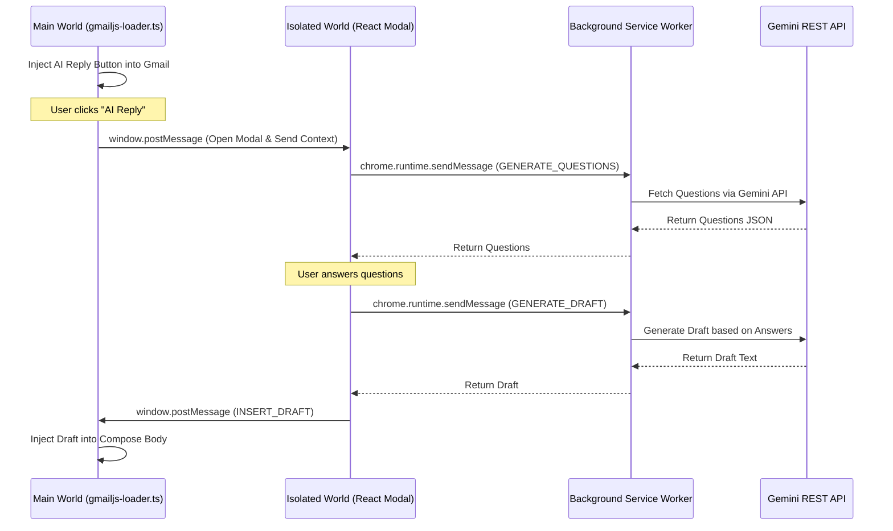

# Gmail AI Reply Assistant

   

<br />
<div align="center">
  
</div>
<br />

## Overview
Gmail AI Reply Assistant is a powerful Manifest V3 Chrome Extension that seamlessly integrates into Gmail to help you craft professional, context-aware email replies. Powered by the Google Gemini API, it analyzes the context of your email thread, asks you 2-3 clarifying questions to determine your intent, and generates a personalized, high-quality reply drafted directly into your compose window.

## Key Features
- **Context-Aware Question Generation**: Automatically extracts the email thread context and generates highly relevant clarifying questions to guide the tone and content of the reply.
- **Custom Material Design 3 Modal**: A fully custom, sleek React-based UI that matches Google's own MD3 design system for a native look and feel inside Gmail.
- **Secure API Key Storage**: Your Gemini API key is stored securely using local storage, keeping you in full control of your credentials.
- **Intelligent Draft Injection**: Seamlessly inserts the AI-generated reply back into the Gmail compose body using `gmail-js`.

## Architecture

The extension uses a multi-world architecture to comply with Manifest V3 restrictions and Gmail's strict Content Security Policy.



## Installation (Developer Mode)

To install and test this extension locally, follow these steps:

1. **Clone the repository:**
   ```bash
   git clone <repository-url>
   cd gmail-ai-reply
   ```

2. **Install dependencies:**
   ```bash
   npm install
   ```

3. **Build the extension:**
   ```bash
   npm run build
   ```
   This will generate a `dist/` directory containing the compiled extension.

4. **Load into Chrome:**
   - Open Google Chrome and navigate to `chrome://extensions/`.
   - Enable **Developer mode** in the top right corner.
   - Click on **Load unpacked** in the top left.
   - Select the `dist/` folder generated in step 3.

5. **Configure API Key:**
   - Click on the extension icon in your Chrome toolbar to open the settings popup.
   - Enter your Gemini API key (you can get one from Google AI Studio).

## Tech Stack
- **Framework**: React 18
- **Build Tool**: Vite + CRXJS Vite Plugin
- **Styling**: Tailwind CSS
- **DOM Interoperability**: `gmail-js`, jQuery
- **Manifest Version**: MV3
- **AI Integration**: Google Gemini API via REST

## Security Note
> [!IMPORTANT]
> Your API keys are stored **entirely locally** using `chrome.storage.local`. They are never sent to third-party servers, databases, or analytics services. The only external requests made with your API key are to Google's official generative AI endpoints (`https://generativelanguage.googleapis.com`).
