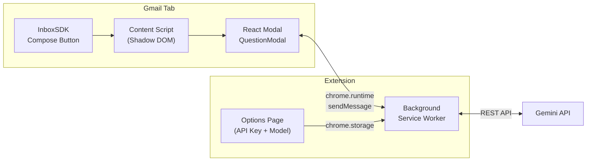

# Gmail AI Reply — Build Walkthrough

## Summary

Built a complete Manifest V3 Chrome Extension that injects an AI reply assistant into Gmail. The extension uses InboxSDK to add a sparkle button to the compose toolbar, generates clarifying questions via the Gemini API, and drafts replies based on user answers.

## Architecture



## Files Created

### Config & Build
| File | Purpose |
|---|---|
| [`package.json`](file:///d:/Codes/Gmail%20AI%20Reply/package.json) | Dependencies: React 18, InboxSDK, Tailwind v3, CRXJS, Vite 5 |
| [`manifest.json`](file:///d:/Codes/Gmail%20AI%20Reply/manifest.json) | MV3 manifest with storage permission, Gmail content script |
| [`vite.config.ts`](file:///d:/Codes/Gmail%20AI%20Reply/vite.config.ts) | CRXJS + React plugin integration |
| [`tailwind.config.js`](file:///d:/Codes/Gmail%20AI%20Reply/tailwind.config.js) | Custom colors (primary/surface), modal animations, shadows |
| [`tsconfig.json`](file:///d:/Codes/Gmail%20AI%20Reply/tsconfig.json) | ES2020, React JSX transform, bundler resolution |

---

### Shared Utilities
| File | Purpose |
|---|---|
| [`messaging.ts`](file:///d:/Codes/Gmail%20AI%20Reply/src/shared/messaging.ts) | Type-safe `GENERATE_QUESTIONS` and `GENERATE_DRAFT` message contracts |
| [`storage.ts`](file:///d:/Codes/Gmail%20AI%20Reply/src/shared/storage.ts) | `chrome.storage.local` wrapper with 4 Gemini models catalog |

---

### Background Service Worker
| File | Purpose |
|---|---|
| [`index.ts`](file:///d:/Codes/Gmail%20AI%20Reply/src/background/index.ts) | Message router, opens Options page on first install |
| [`gemini.ts`](file:///d:/Codes/Gmail%20AI%20Reply/src/background/gemini.ts) | Gemini REST API client with system prompts, JSON mode for questions, fallback parsing |

---

### Content Script & React UI
| File | Purpose |
|---|---|
| [`index.tsx`](file:///d:/Codes/Gmail%20AI%20Reply/src/content/index.tsx) | InboxSDK init (dummy app ID), button injection, Shadow DOM mounting, email context extraction |
| [`App.tsx`](file:///d:/Codes/Gmail%20AI%20Reply/src/content/App.tsx) | Root component bridging modal to InboxSDK compose view |
| [`QuestionModal.tsx`](file:///d:/Codes/Gmail%20AI%20Reply/src/content/components/QuestionModal.tsx) | 4-state modal: loading → questions → generating → error with retry |
| [`LoadingSpinner.tsx`](file:///d:/Codes/Gmail%20AI%20Reply/src/content/components/LoadingSpinner.tsx) | Animated spinner with configurable size + label |
| [`styles.css`](file:///d:/Codes/Gmail%20AI%20Reply/src/content/styles.css) | Tailwind directives + Shadow DOM `:host` reset |

---

### Options Page
| File | Purpose |
|---|---|
| [`options.html`](file:///d:/Codes/Gmail%20AI%20Reply/src/options/options.html) | HTML shell |
| [`main.tsx`](file:///d:/Codes/Gmail%20AI%20Reply/src/options/main.tsx) | React entry point |
| [`Options.tsx`](file:///d:/Codes/Gmail%20AI%20Reply/src/options/Options.tsx) | API key input (show/hide), model radio selector, save with status |
| [`index.css`](file:///d:/Codes/Gmail%20AI%20Reply/src/options/index.css) | Gradient background + Tailwind |

## Build Results

```
✓ 44 modules transformed
✓ built in 5.75s

dist/
├── assets/
│   ├── index.tsx-DrQizXHs.js    (1,061 kB) — Content script bundle (React + InboxSDK)
│   ├── client-DhEz86-d.js        (141 kB) — CRXJS runtime
│   ├── options.html-h9XvEwYz.js     (7 kB) — Options page bundle
│   └── options-DvTkmBTm.css       (17 kB) — Options page styles
├── icons/                                   — Extension icons
├── src/options/options.html                 — Options page
├── manifest.json                            — Built MV3 manifest
└── service-worker-loader.js                — Background service worker loader
```

## How to Test

### Load the Extension
1. Run `npm run build` in the project root
2. Open Chrome → navigate to `chrome://extensions/`
3. Enable **Developer mode** (top-right toggle)
4. Click **Load unpacked** → select the `dist/` folder

### Configure API Key
1. Right-click the extension icon → **Options** (or it opens automatically on first install)
2. Paste your Gemini API key
3. Select your preferred model (default: Gemini 2.0 Flash)
4. Click **Save Settings**

### Use in Gmail
1. Open [Gmail](https://mail.google.com)
2. Open any email thread and click **Reply**
3. Look for the ✨ **sparkle button** in the compose toolbar
4. Click it → the AI will analyze the thread and show 2-3 clarifying questions
5. Answer the questions → click **Generate Reply**
6. The drafted reply is automatically inserted into the compose body

### Development Mode
```bash
npm run dev
```
CRXJS provides HMR — changes to React components auto-reload in the browser.

## Key Design Decisions

1. **Shadow DOM** for the React modal — completely isolates Tailwind styles from Gmail's CSS
2. **`?inline` CSS import** — Vite compiles Tailwind and returns it as a string, injected directly into the shadow root
3. **Dummy InboxSDK App ID** — works for development; register at inboxsdk.com for production
4. **`responseMimeType: "application/json"`** — forces Gemini to output valid JSON for reliable question parsing, with regex fallback
5. **Multi-strategy email extraction** — tries InboxSDK API → Gmail quote selectors → DOM thread scraping → compose body fallback
